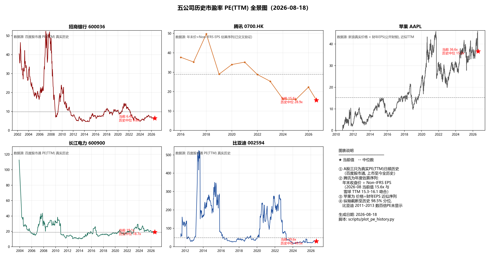
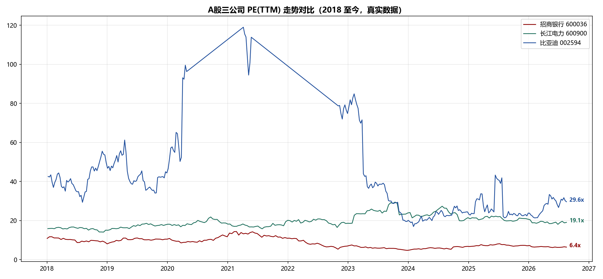

# 五公司历史 PE 图表（2026-08-18）

> 生成方式：`scripts/plot_pe_history.py`（Python + akshare + matplotlib）
> 数据缓存：`data/pe_*.csv`，重跑脚本可复现

## 一、全景图

## 二、A股三公司对比（2018 至今，真实日频数据）

## 三、关键统计

| 公司 | 当前 PE(TTM) | 2015 年以来中位数 | 2015 年以来分位 | 全历史中位数* | 解读 |
|---|---|---|---|---|---|
| 腾讯 0700.HK | **15.6x** | 28.9x | **0%（最低）** | 28.9x | 上市以来估值最低区间——AI 投入期的"戴维斯双杀后" |
| 招商银行 600036 | **6.4x** | 7.8x | 17% | 9.8x | 破净+低分位，息差拐点是修复钥匙 |
| 比亚迪 002594 | 29.6x | 42.3x | 26% | 49.5x | 周期回落中的中低分位，等待盈利拐点确认 |
| 长江电力 600900 | 19.1x | 18.5x | 58% | 18.7x | 恰在中位数——估值不贵不便宜，靠股息率-国债利差定价而非 PE |
| 苹果 AAPL | **36.6x** | 24.5x | **84%（最高）** | 15.4x | 五家中唯一处历史高位——最强基本面 vs 最贵估值 |

*全历史中位数口径为上市以来（招行 2002、长电 2004、比亚迪 2011 起）。

## 四、口径与数据源说明（重要）

| 公司 | 数据源 | 口径 | 可信度 |
|---|---|---|---|
| 招行 / 长电 / 比亚迪 | 百度股市通估值接口（akshare） | PE(TTM)，日频，上市至今 | 真实数据 |
| 苹果 AAPL | 新浪真实日线价格 × 苹果财年稀释 EPS（公开财报） | 近似 PE(TTM)（财年 EPS 有滞后） | 高（当前值 36.6x 与雪球 TTM 折算一致） |
| 腾讯 0700.HK | 年末收盘价 × Non-IFRS 年度 EPS / 股本 / 汇率 | 年度估算序列 | 中高（当前值 15.6x 与雪球 TTM 15.3-16.1 吻合；2025 年末点为估算） |

**已知局限**：①腾讯为年度稀疏序列，年内波动不可见（2021 年初高点约 48x、2022 年 10 月低点 IFRS 口径约 9-10x 均未单独标注）；②苹果财年 EPS 滞后约 1 个月；③比亚迪 2011-2013 数百倍 PE 已在纵轴截断（98.5% 分位）。

## 五、与五份个股报告的交叉验证

| 报告口径 | 图表口径 | 一致性 |
|---|---|---|
| 腾讯报告：PE(TTM) 15.8-16.1 | 15.6x | ✓ |
| 长电报告：PE(TTM) 19.2 | 19.1x | ✓ |
| 比亚迪报告：PE(TTM) 29.4 | 29.6x | ✓ |
| 招行报告：PE 6.43 | 6.4x | ✓ |
| AAPL 报告：37-40x（333 时） | 36.6x（305.6 时） | ✓ |

*免责声明：腾讯与苹果序列为近似计算（口径见上表），仅供估值区间参考，不构成投资建议。*
